### Задание 1

* Языки низкого уровня — языки, на которых можно непосредственно написать программу, исполняемую на физическом устройстве.
* Исполняемый файл (исполняемый код) — файл, содержащий программу в виде набора элементарных инструкций, которая после загрузки в память может быть выполнена на определенном физическом устройстве (процессоре) под управлением определенной операционной системы.
* Ассемблер — язык программирования низкого уровня, в котором каждая инструкция физического устройства представлена в текстовом виде.
* Язык высокого уровня — язык, который абстрагируется от элементарных команд процессора, позволяя записывать программы в виде более абстрактных понятий, таких как: функции, алгоритмы, классы, структуры данных и т.д.
* Исходный код — программа, написанная на языке высокого уровня.
* Виртуальная машина — средство описания семантики языка программирования. Описание виртуальной машины должно давать ответ на вопросы о работе синтаксических конструкций программы и содержит правила ее использования и информацию о поведении машины при нарушении этих правил.
* Виды виртуальных машин — физическое устройство, работающее под управлением операционной системы (языки низкого уровня); программная реализация (Java); абстрактное описание (большинство языков программирования).
* Стандарт языка программирования — документ, описывающий язык программирования максимально подробно и, по возможности, наиболее формально.
* Цель стандартизации — согласование между разработчиками языка и пользователями того, какие тексты следует считать программами, и как эти программы будут исполняться.
* Deprecated (устаревшие возможности) — возможности языка программирования, которые новые стандарты отменяют или объявляют устаревшими.
* Транслятор — техническое средство, осуществляющее перевод текста программы с одного языка на другой.
* Компилятор — транслятор, переводящий программу в машинный код для последующего исполнения (С++). Чистый компилятор генерирует аппаратно-зависимый код.
* Интерпретатор — транслятор, читающий и исполняющий программу по одной команде (Lisp). Чистый интерпретатор возможен только для языков с достаточно простым синтаксисом.
* Псевдокомпилятор — транслятор, переводящий программу в промежуточное представление (байт-код), который состоит из набора инструкций близких по смыслу к машинному коду.
* Байт-код — промежуточное представление программы из набора инструкций, близких по смыслу к машинному коду, которое впоследствии выполняется на виртуальной машине.
* Компилирующий интерпретатор — транслятор, переводящий текст программы во внутреннее представление непосредственно после запуска. В процессе работы программа интерпретируется уже в этом представлении (Python).
* REPL-интерпретатор — программное средство, работающее в цикле чтения-вычисления-печати (Read-Eval-Print Loop). Интерпретатор в режиме диалога считывает законченную конструкцию языка, транслирует ее, исполняет и выводит результат (IDLE shell Python).
* Единица трансляции — минимальный фрагмент программы, который может быть транслирован независимо от остального кода. В С++ это один файл (.c, .cc, .cpp), в Java — один публичный класс, в Python — один модуль.
* Этапы жизненного цикла программы — написание исходного кода; предобработка; синтаксический анализ и генерация кода; оптимизация кода; сборка (связывание); загрузка; выполнение.
* Предобработка — выполнение замен в тексте программ по заданным правилам.
* Синтаксический анализ и генерация кода — проверка синтаксиса и генерация объектного кода или внутреннего представления программы.
* Сборка (связывание) — объединение отдельных модулей (единиц трансляции) и внешних библиотек в исполняемую программу; заключительный этап трансляции, результатом которого является исполняемый файл.
* Загрузка — загрузка программы в память для последующего исполнения.
* Синтаксические ошибки — ошибки, обнаруживаемые на этапе проверки синтаксиса во время трансляции.
* Ошибки сборки — ошибки, возникающие при отсутствии одного из компонентов программы.
* Ошибки времени выполнения (run time error) — ошибки использования виртуальной машины языка программирования, обнаруживаемые в момент их возникновения, например, деление на ноль или выход за границы массива.
* Непредсказуемое поведение — в результате неверного использования виртуальной машины языка программирования дальнейшее исполнение программы может приводить к непредсказуемым ошибкам, то есть ошибки проявляются позже в непредсказуемый момент в непредсказуемом виде.
* Неопределенное поведение — поведение программы однозначно, но не определено описанием языка. Программы с неопределенным поведением могут давать различные результаты при использовании различных трансляторов.
* Препроцессинг (предобработка) — начальный этап трансляции программы, в ходе которого выполняются макроподстановки в исходный текст программы. Результатом препроцессинга является текст программы, который далее проходит синтаксический анализ.
* Директива #include — формально считается, что текст директивы заменяется на содержимое файла, имя которого указано в угловых скобках; фактически используется для раздельной компиляции и подключения библиотек.
* Директива #pragma — используется для задания параметров трансляции.
* Директива #define — позволяет заменить имя макроса на его текст.
* Условная трансляция — директивы #ifdef, #ifndef, #else, #endif.
* Объектный файл (объектный код) — результат трансляции модуля, переходный от текста программы к исполняемому файлу. Объектный файл содержит имена идентификаторов из текста программы, но команды уже переведены на язык исполнителя. На этапе сборки имена идентификаторов заменяются на адреса в памяти.
* make — утилита для управления процессом компиляции и сборки программ. Собирает и хранит информацию о зависимостях в единицах трансляции и использует ее для оптимизации процесса трансляции, запускает процесс сборки, записанный в файле makefile.
* Дизассемблирование — перевод байт-кода в текстовый вид.

### Задание 2

Сочетания клавиш Far Manager, использованные в работе:

* Enter — зайти в выделенную папку.
* Ctrl+O — открыть или закрыть командную строку.
* F3 — просмотреть содержимое файла.
* F4 — открыть файл во встроенном редакторе.
* F6 — переместить или переименовать выделенный файл/папку.
* F7 — создать новую папку.
* F8 — удалить файл или папку.
* F1 — вызвать справку.
* F10 — выйти из Far Manager.

### Задание 3

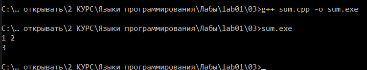

### Задание 4

#### Создание объектных файлов

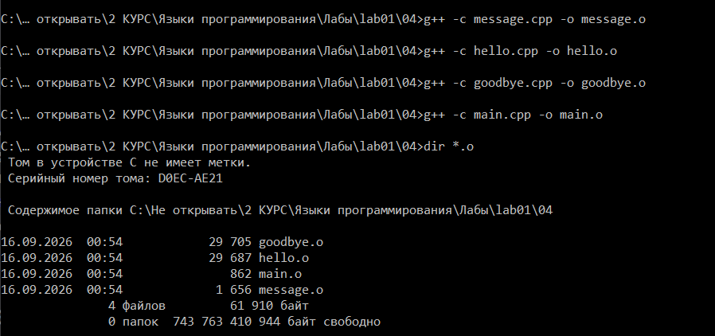

#### Сборка и проверка работоспособности

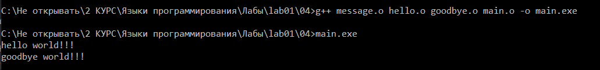

#### Компиляция при синтаксической ошибке в другом файле

Компиляция `goodbye.cpp` завершается ошибкой, а `hello.cpp` компилируется

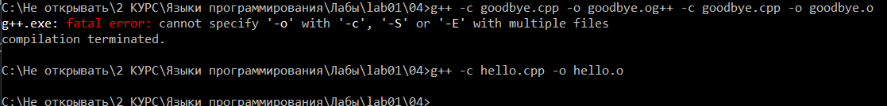

#### Сборка при потерянном объектном файле

Сборка из оставшихся объектных файлов завершается ошибкой 

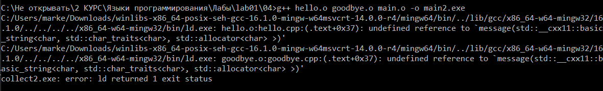

### Задание 5

#### Создание class-файлов

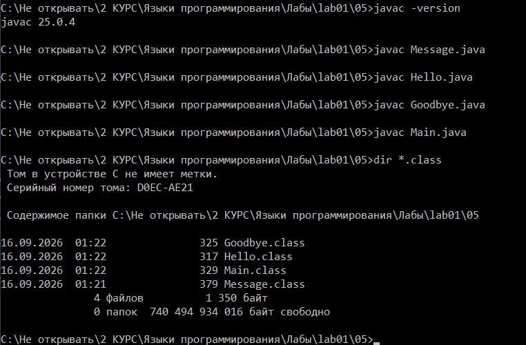

#### Запуск и проверка работоспособности

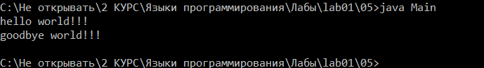

#### Компиляция при синтаксической ошибке в другом файле

Компиляция `Goodbye.java` завершается ошибкой, а `Hello.java` компилируется

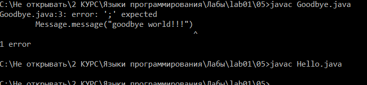

#### Запуск при потерянном class-файле

Запуск завершается ошибкой

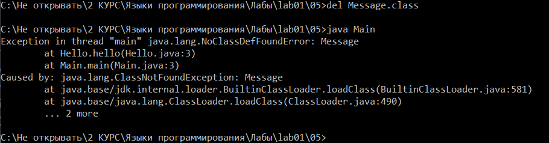

### Задание 6

#### Компиляция модулей в байт-код

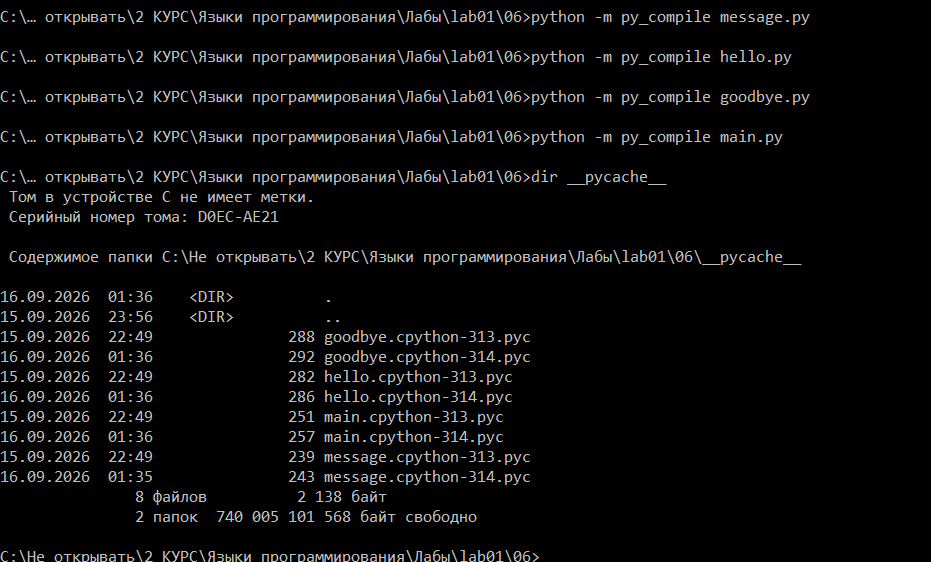

#### Запуск и проверка работоспособности

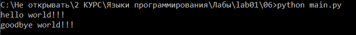

#### Компиляция при синтаксической ошибке в другом файле

Компиляция `goodbye.py` завершается ошибкой, а `hello.py` компилируется

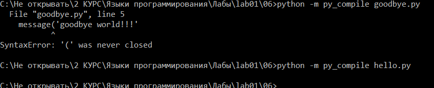

#### Запуск при потерянном модуле

Запуск завершается ошибкой

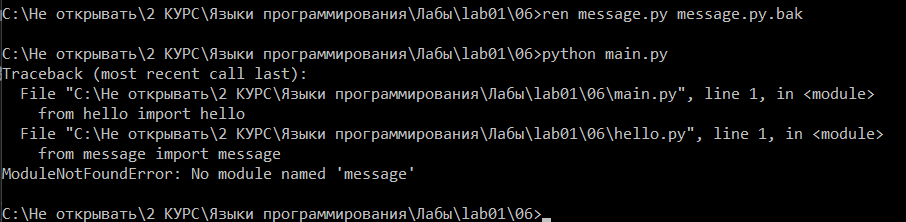

### Задание 8

#### 1. std::vector

`std::vector` компилируется и работает уже с `-std=c++98`

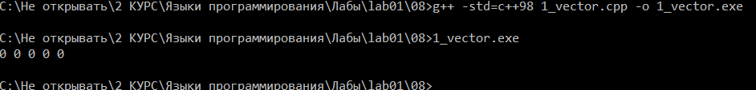

#### 2. Цикл по коллекции

С `-std=c++98` компиляция падает. Начиная с `-std=c++11` конструкция компилируется и работает.

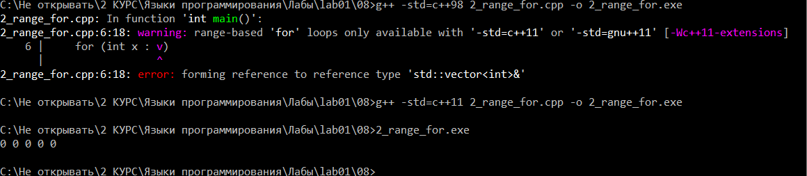

#### 3. Вывод типа по инициализатору (auto)

С `-std=c++11` `auto` заработал как вывод типа.

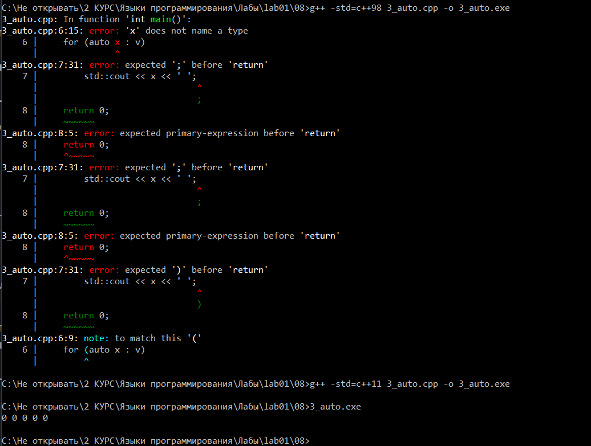

#### 4. Инициализация списком

С `-std=c++11` конструкция работает.

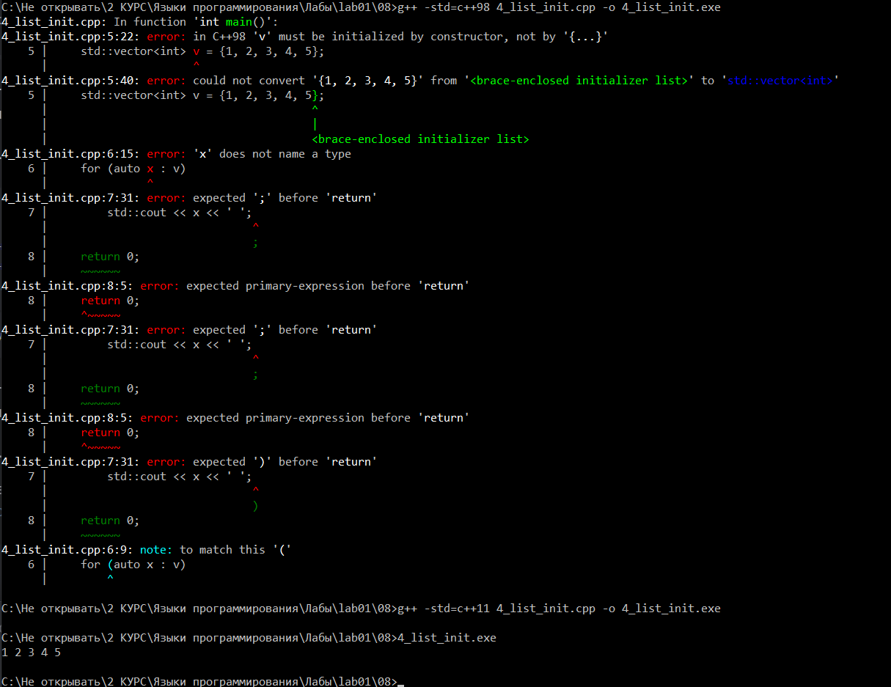

#### 5. Сепараторы разрядов

Работает только начиная с `-std=c++14`.

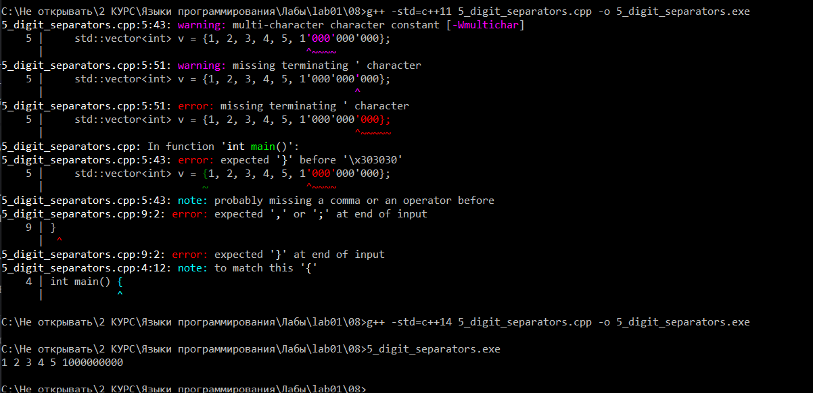

#### 6. Вывод типа по конструктору (CTAD)

Автоматический вывод параметров шаблона по конструктору появился только в `-std=c++17`.

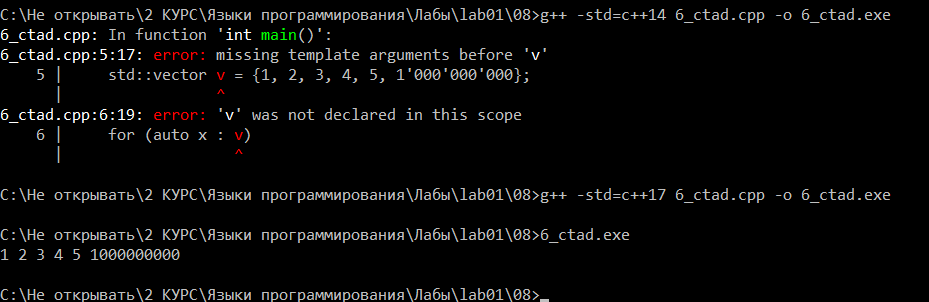

### Задание 9

* Переменные: на `-O0` `x` и `s` лежат на стеке (`-4(%rbp)`, `-12(%rbp)`), на `-O1`/`-O2` — только в регистрах.
* Кадр стека: `-O0` строит его явно (`pushq %rbp` / `movq %rsp, %rbp`), `-O1`/`-O2` обходятся без `rbp`.
* Цикл: на `-O0` выполняется буквально 123 раза (`cmpl`/`jle`). На `-O1` накопление `s += x` заменено на `imull $123, %edx, %edx`, но пустая оболочка цикла (`subl $1, %eax; jne`) осталась — частичная оптимизация. На `-O2` цикла нет вообще, только `imull $123, 44(%rsp), %edx`.
* Обнуление `eax` перед `return 0`: `-O0`/`-O1` — `movl $0, %eax`, `-O2` — `xorl %eax, %eax` (короче и быстрее).
* Результат работы программы (`123 * x`) одинаков на всех уровнях — меняется только сам код, не поведение.
